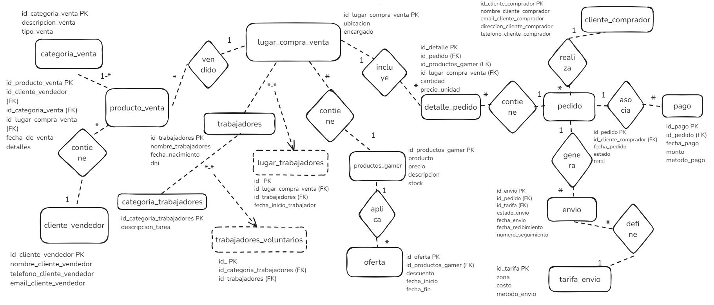
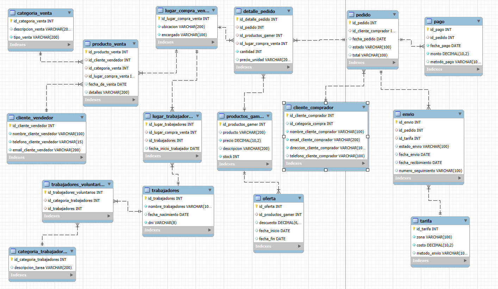

# Proyecto sql: MALTA GAMERS

### Introduccion
La base de datos malta_gamers está diseñada para gestionar un sistema de ventas y compras de productos gamers, permitiendo el manejo de vendedores, compradores, pedidos, pagos, envíos y trabajadores.

### Situación problema

En el comercio de productos gamers, es común enfrentar problemas para gestionar y realizar un seguimiento efectivo de las transacciones que involucran a múltiples participantes: vendedores, compradores, productos, trabajadores y envíos.

1. **Dificultad para rastrear el inventario**: Es complejo identificar el estado y disponibilidad de cada producto, lo que puede llevar a ventas duplicadas o falta de stock.
2. **Control ineficiente de ventas y compras**: Sin una estructura que distinga entre vendedores y compradores, se dificulta saber quién realizó qué transacción y cuándo.
3. **Problemas en la gestión de pagos y envíos**: La falta de control sobre los pagos, métodos de envío y tiempos de entrega puede afectar la satisfacción del cliente y provocar pérdidas en ventas.
4. **Mala administración de personal**: Sin una estructura para organizar empleados y roles, se vuelve difícil gestionar tareas y asignar responsabilidades.

### Solución Propuesta

La base de datos malta_gamers proporciona una estructura bien organizada para resolver estos problemas en la gestión de un comercio de productos gamers.

#### Rastrear el Inventario
   - La tabla productos_gamer mantiene un registro detallado de cada producto, incluyendo **stock**, **precio** y **descripción**.
   - La tabla oferta permite aplicar descuentos a productos específicos, facilitando promociones temporales.

#### Gestionar Ventas y Compras
   - Las tablas cliente_vendedor y cliente_comprador diferencian entre usuarios que venden y compran, permitiendo un seguimiento claro de los roles y transacciones de cada cliente.
   - La tabla producto_venta registra los productos que los vendedores han puesto a la venta, mientras que pedido almacena los pedidos de los compradores.
   - La tabla detalle_pedido proporciona información granular sobre cada producto en el pedido, como cantidad, precio y lugar de venta.

#### Control de Pagos y Envíos
   - La tabla pago almacena información detallada de cada transacción, facilitando el seguimiento de los pagos y métodos de pago.
   - La tabla envio permite rastrear el estado de los envíos, con fechas de envío, recepción y número de seguimiento para asegurar una entrega precisa y transparente.

#### Administración de Personal
   - Las tablas trabajadores y categoria_trabajadores permiten gestionar empleados y sus roles, asignando descripciones a sus tareas específicas.
   - La tabla lugar_trabajadores registra las ubicaciones en las que cada trabajador ha estado asignado, facilitando la asignación de responsabilidades según ubicación.

## Diagrama Entidad Relación/ DER Malta gamers

## DER MySQL Workbench

## Tablas y descripción de los campos

### Tabla producto_venta
- **Descripción**: Productos de venta de las personas
  * **id_producto_venta** (INT, PK, AUTO_INCREMENT): Identificador único de venta de producto.
  * **id_cliente_vendedor** (INT, FK): Identificador del vendedor (relacionado con cliente_vendedor).
  * **id_categoria_venta** (INT, FK): Categoría del producto (relacionado con categoria_venta).
  * **id_lugar_compra_venta** (INT, FK): Ubicación de la venta (relacionado con lugar_compra_venta).
  * **fecha_de_venta** (DATE): Fecha de la venta.
  * **detalles** (VARCHAR(200)): Descripción del producto.

- **Relaciones**:
  * FK con cliente_vendedor en id_cliente_vendedor.
  * FK con categoria_venta en id_categoria_venta.
  * FK con lugar_compra_venta en id_lugar_compra_venta.

---

### Tabla cliente_vendedor
- **Descripción**: Registro de clientes que venden productos.
  * **id_cliente_vendedor** (INT, PK, AUTO_INCREMENT): Cliente único.
  * **nombre_cliente_vendedor** (VARCHAR(100)): Nombre del cliente.
  * **telefono_cliente_vendedor** (VARCHAR(15)): Número de teléfono.
  * **email_cliente_vendedor** (VARCHAR(200), UNIQUE): Correo electrónico del cliente.

---

### Tabla categoria_venta
- **Descripción**: Define las categorías para los productos en venta.
  * **id_categoria_venta** (INT, PK, AUTO_INCREMENT): Identificador único de categoria
  * **descripcion_venta** (VARCHAR(200)): Descripción.
  * **tipo_venta** (VARCHAR(200)): Tipo de venta.

---

### Tabla lugar_compra_venta
- **Descripción**: Lugares donde se realizan las transacciones de compra y venta.
  * **id_lugar_compra_venta** (INT, PK, AUTO_INCREMENT): Identificador único del lugar
  * **ubicacion** (VARCHAR(200), UNIQUE): Ubicación del lugar.
  * **encargado** (VARCHAR(100)): Persona responsable del lugar.

---

### Tabla trabajadores
- **Descripción**: Información de los trabajadores del lugar.
  * **id_trabajadores** (INT, PK, AUTO_INCREMENT): Identificador único del trabajador.
  * **nombre_trabajadores** (VARCHAR(100)): Nombre del trabajador.
  * **fecha_nacimiento** (DATE): Fecha de nacimiento del trabajador.
  * **dni** (VARCHAR(8)): Documento de identidad.

---

### Tabla categoria_trabajadores
- **Descripción**: Categorización de las tareas de los empleados.
  * **id_categoria_trabajadores** (INT, PK, AUTO_INCREMENT): Identificador único de las categorias.
  * **descripcion_tarea** (VARCHAR(200)): Descripción de la tarea asignada.

---

### Tabla detalle_pedido
- **Descripción**: Detalle de los productos incluidos en cada pedido.
  * **id_detalle_pedido** (INT, PK, AUTO_INCREMENT): Identificador único del detalle.
  * **id_pedido** (INT, FK): Referencia al pedido.
  * **id_productos_gamer** (INT, FK): Productos específicos en el pedido.
  * **id_lugar_compra_venta**(INT, FK): Lugar donde se realizó el pedido.
  * **cantidad** (INT): Cantidad del producto.
  * **precio_unidad** (VARCHAR(200)): Precio por unidad del producto.

- **Relaciones**:
  - FK con pedido en id_pedido.
  - FK con productos_gamer en id_productos_gamer.
  - FK con lugar_compra_venta en id_lugar_compra_venta.

---

### Tabla pedido
- **Descripción**: Información básica de los pedidos realizados.
  * **id_pedido** (INT, PK, AUTO_INCREMENT): Identificador único del pedido.
  * **id_cliente_comprador** (INT, FK): Cliente que realizó el pedido.
  * **fecha_pedido** (DATE): Fecha del pedido.
  * **estado** (VARCHAR(100)): Estado actual del pedido.
  * **total** (VARCHAR(100)): Total del pedido.

- **Relaciones**:
  - FK con cliente_comprador en id_cliente_comprador.

---

### Tabla cliente_comprador
- **Descripción**: Información de los clientes que compran productos.
  * **id_cliente_comprador** (INT, PK, AUTO_INCREMENT): Identificador único del cliente.
  * **id_categoria_compra** (INT): Categoría de la compra.
  * **nombre_cliente_comprador** (VARCHAR(100)): Nombre del cliente.
  * **email_cliente_comprador** (VARCHAR(200), UNIQUE): Correo del cliente.
  * **direccion_cliente_comprador** (VARCHAR(100), UNIQUE): Dirección del cliente.
  * **telefono_cliente_comprador** (VARCHAR(100)): Teléfono de contacto.

---

### Tabla pago
- **Descripción**: Registros de los pagos de cada pedido.
  * **id_pago** (INT, PK, AUTO_INCREMENT): Identificador único del pago.
  * **id_pedido** (INT, FK): Pedido al que corresponde el pago.
  * **fecha_pago** (DATE): Fecha del pago.
  * **monto** (DECIMAL(10,2)): Monto pagado.
  * **metodo_pago** (VARCHAR(100)): Método utilizado.

- **Relaciones**:
  - FK con pedido en id_pedido.

---

### Tabla envio
- **Descripción**: Detalle de los envíos de cada pedido.
  * **id_envio** (INT, PK, AUTO_INCREMENT): Identificador único del envio.
  * **id_pedido** (INT, FK): Pedido asociado al envío.
  * **id_tarifa** (INT, FK): Tarifa aplicada.
  * **estado_envio** (VARCHAR(100)): Estado del envío.
  * **fecha_envio** (DATE): Fecha de envío.
  * **fecha_recibimiento** (DATE): Fecha de recepción.
  * **numero_seguimiento** (VARCHAR(100)): Código de seguimiento.

- **Relaciones**:
  - FK con pedido en id_pedido.
  - FK con tarifa en id_tarifa.

---

### Tabla tarifa
- **Descripción**: Información de tarifas de envío.
  * **id_tarifa** (INT, PK, AUTO_INCREMENT): Identificador único de tarifa.
  * **zona** (VARCHAR(100)): Zona geográfica.
  * **`costo** (DECIMAL(10,2)): Costo de la tarifa.
  * **`metodo_envio** (VARCHAR(100)): Método de envío.

---

### Tabla productos_gamer
- **Descripción**: Información de productos gamers en inventario.
  * **id_productos_gamer** (INT, PK, AUTO_INCREMENT): Identificador único de productos.
  * **producto** (VARCHAR(200)): Nombre del producto.
  * **precio** (DECIMAL(10,2)): Precio del producto.
  * **descripcion**(VARCHAR(200)): Descripción.
  * **stock** (INT): Cantidad en inventario.

---

### Tabla oferta
- **Descripción**: Ofertas y descuentos en productos gamers.
  * **id_oferta** (INT, PK, AUTO_INCREMENT): Identificador único de ofertas.
  * **id_productos_gamer** (INT, FK): Producto en oferta.
  * **descuento** (DECIMAL(6,2)): Porcentaje de descuento.
  * **fecha_inicio** (DATE): Inicio de la oferta.
  * **fecha_fin** (DATE): Fin de la oferta.

- **Relaciones**:
  - FK con productos_gamer en id_productos_gamer.

---